项目概述
本项目基于阿里天池 UserBehavior 数据集，构建电商用户行为数据仓库与可视化大屏。
技术栈：Python(Pandas) → MySQL/Hive → Spring Boot → Vue3 + ECharts
数据量：6万+ 条用户行为数据
目标：支持品牌销售、商品热度、用户活跃度、品类销售等多维分析

原始字段名如下：
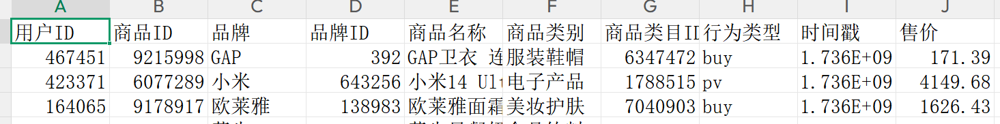

1.ETL
使用 Python(Pandas)完成数据抽取、转换与加载，主要包括以下步骤：
(1) 读取阿里天池用户行为数据
(2)中文字段统一转换为英文
(3)数据清洗(去重、去空值)
(4)Unix 时间戳转换为标准时间
(5)商品价格分层:根据常见电商定价策略(500<低价，500-2000中价，2000-5000高价，>5000奢侈)
(6)导出清洗后的数据
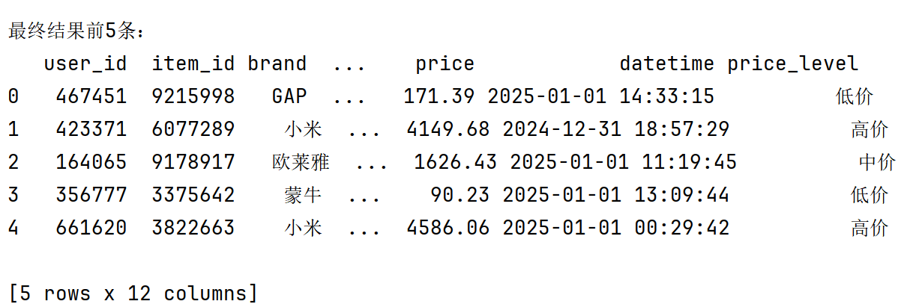

2.MySQL
（1）创建数据库
（2）指定字符集和排序规则
（3）ODS层并查看数据是否导入成功：用户行为原始数据表
（4）DWD 层：商品维度表dim_goods、用户维度表 dim_users、用户行为事实表fact_behavior、商品类别维度表dim_category、品牌维度表dim_brand并插入数据
（5）DWS层：
a.品牌销售统计(dws_brand_sales)统计每个品牌：总销量(buy次数)总销售额(price求和)
b.热门商品统计(dws_item_hot)统计：浏览量(pv)收藏数(fav)购买量(buy)
c.活跃用户统计(dws_user_active)统计:用户id,行为数据，购买数据
d.商品类别统计(dws_category_sales)统计：种类id,种类名称，购买数量，种类总销量
注意：同一个item_id数量有多个不能作为主键，同一个item_id有多个价格，随着行为(促销、优惠券)而变化
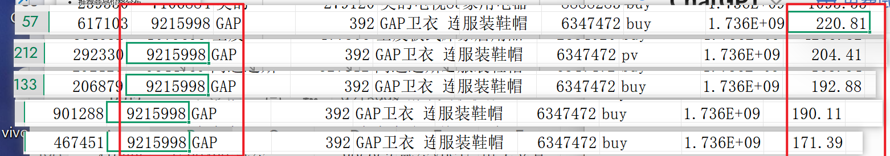
可以看到price 是行为属性,不是商品属性，因此价格仅存在behavior表里
采用星型模型设计数据仓库，将商品、用户、品牌、类别拆分为维度表，将用户行为(包括价格与行为时间)作为事实表存储，从而支持后续的多维分析与推荐系统构建。
MAX() 在 SQL 中用于聚合分组后的最大值，在数仓建模中通常用于保证group by合法性，但不一定代表业务真实含义，
在goods表里没有价格，使用max()没有影响

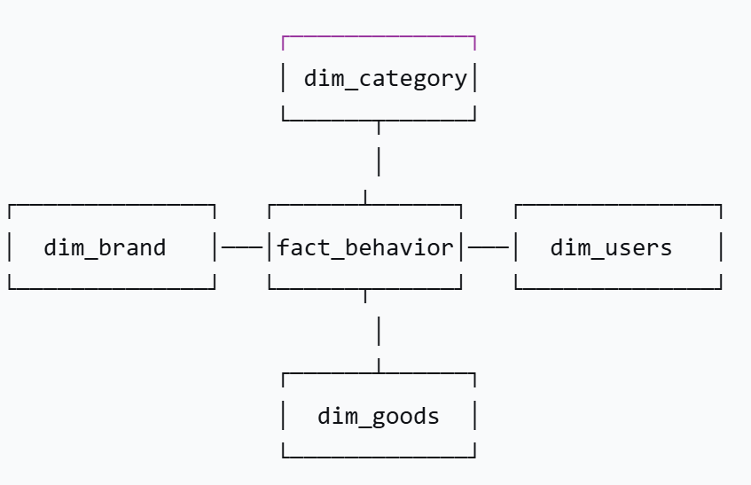

3.springboot（java）接口连接mysql获取dws的四张表

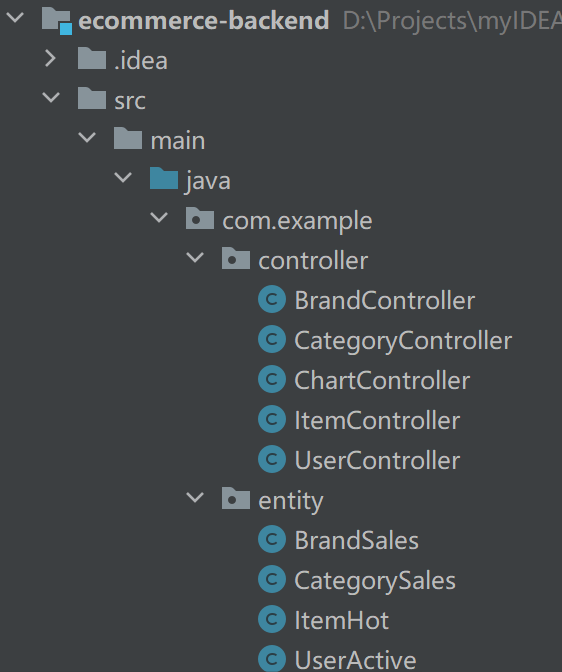

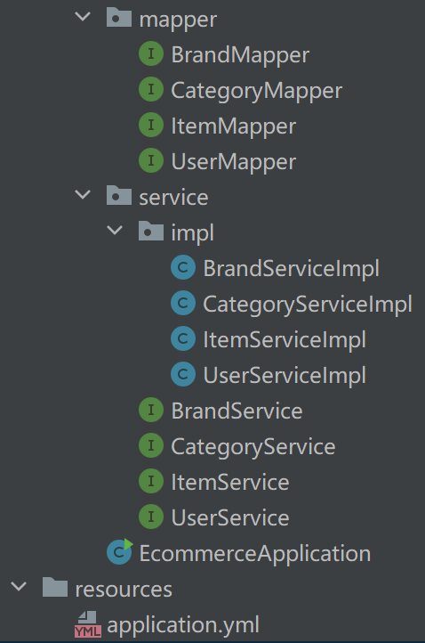

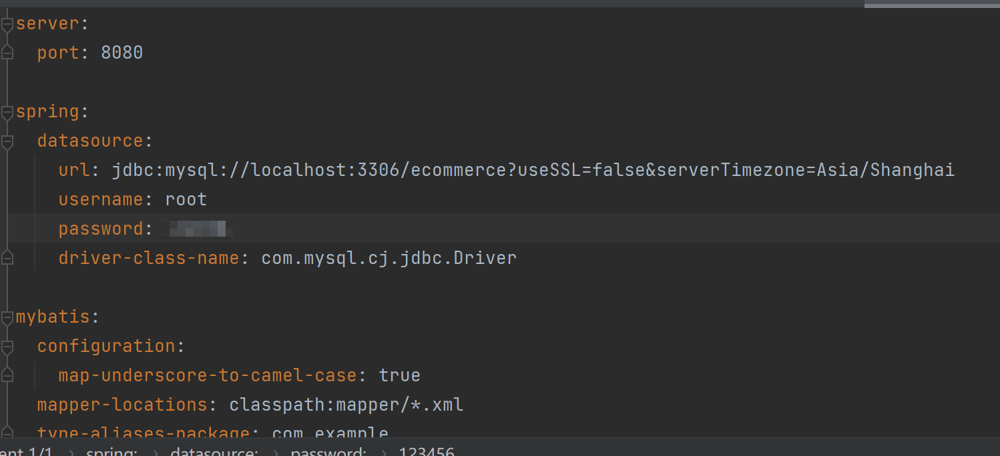

（1）用户活跃接口
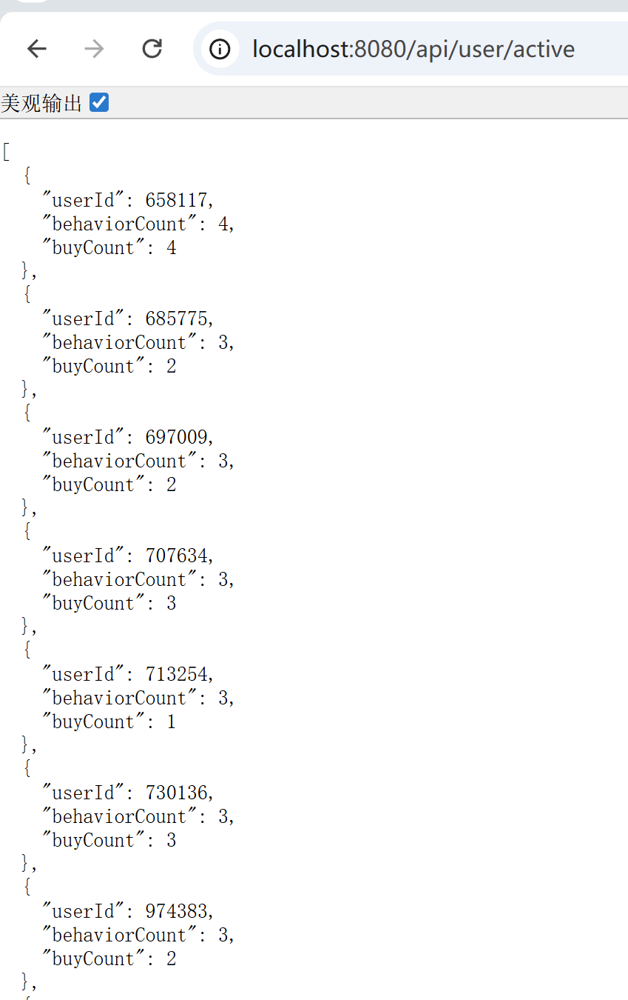

（2）品种销售接口
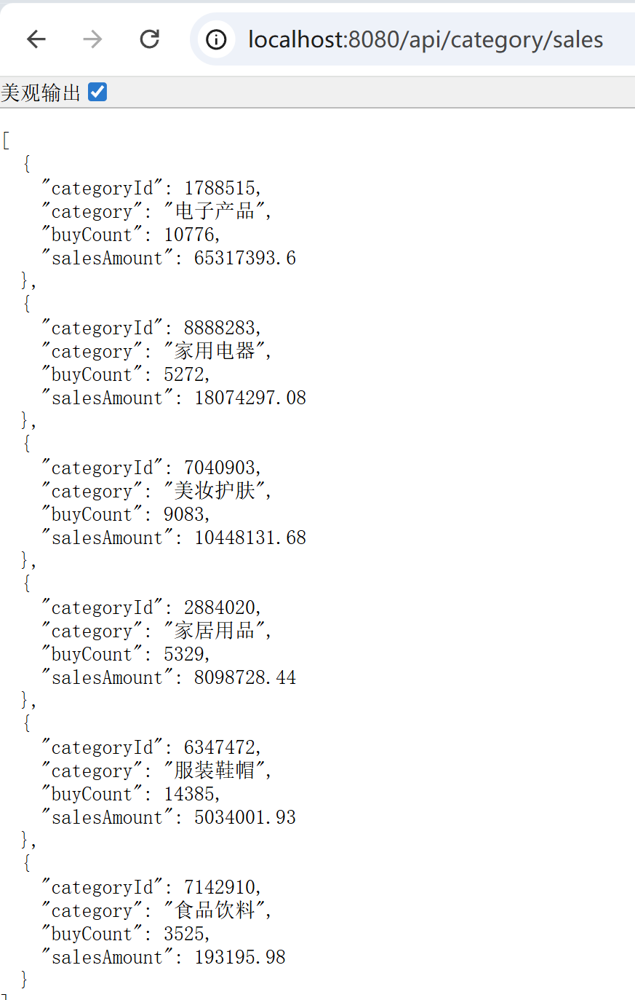

（3）品牌销售接口
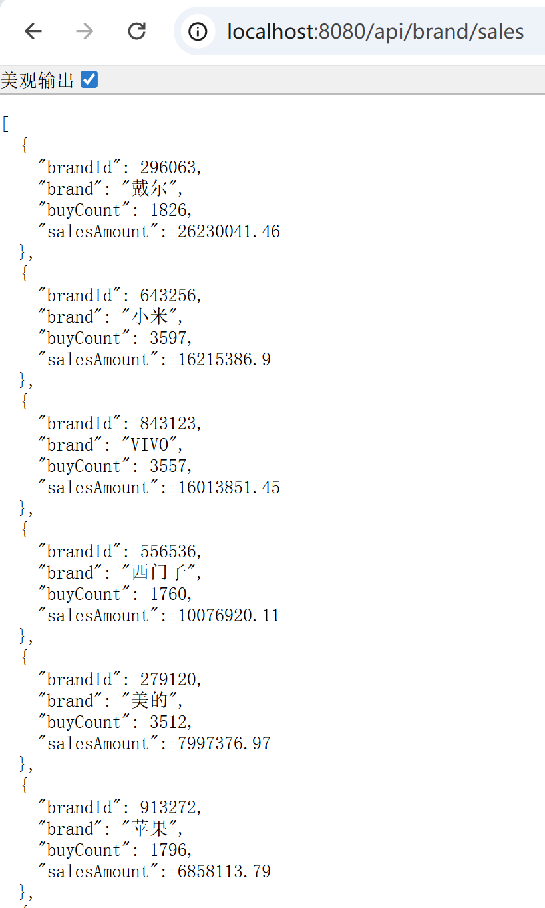

（4）热门商品表
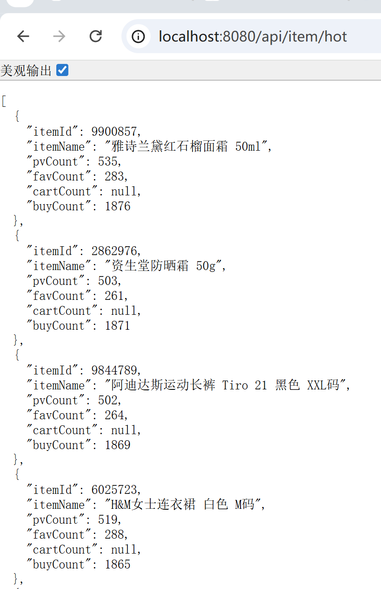

5.Vue3+echarts+axios可视化

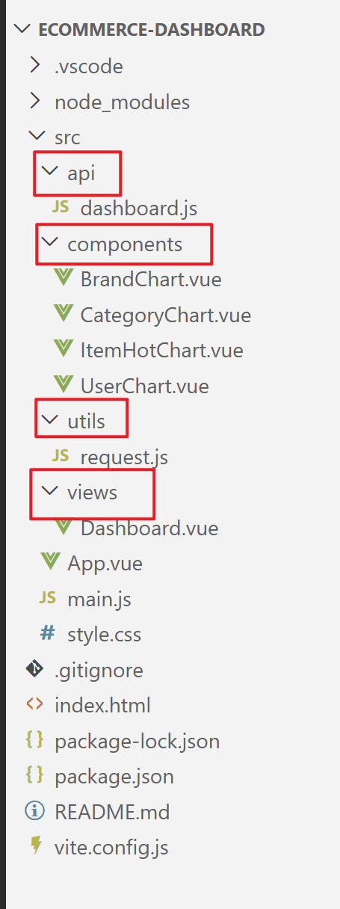

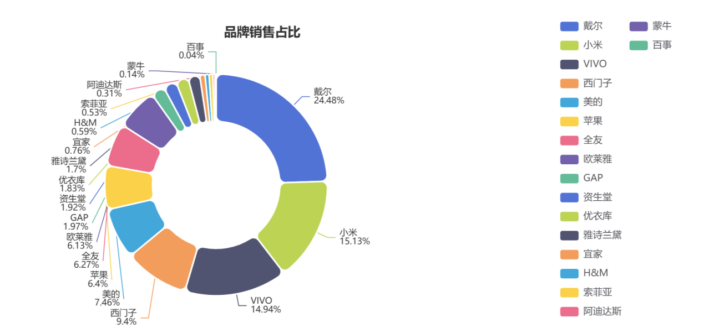

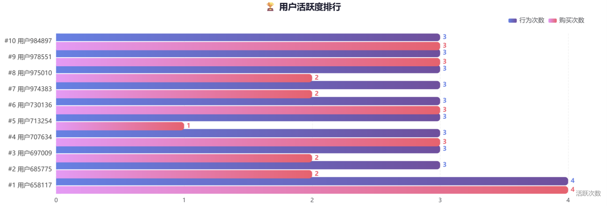

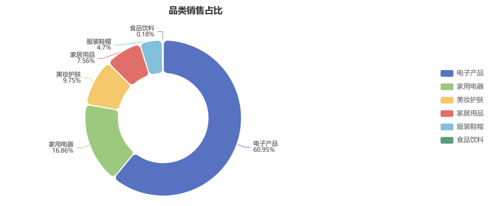

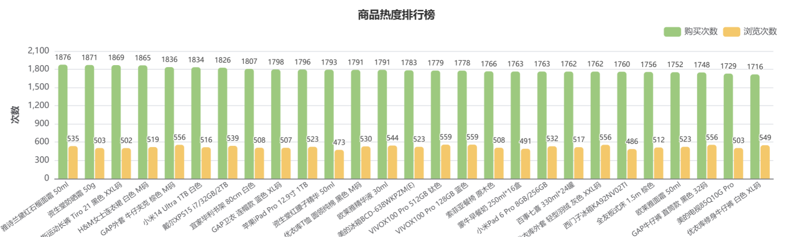

6.优化：mysql的查询速度太慢
hive

A.启动Hadoop：rm -rf /opt/module/hadoop-3.1.3/tmp
hdfs namenode -format
Start-dfs.sh
Start-yarn.sh
jps
    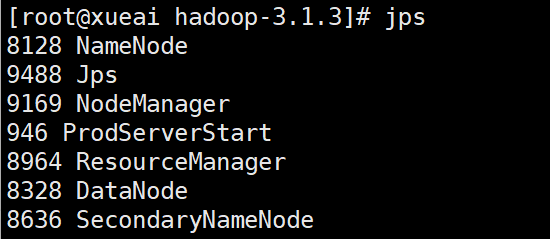         

B.启动hive：hive
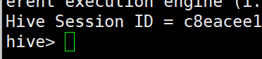
C.采用hive进行数仓迁移：
将 MySQL 中的 ODS/DWD/DWS 表迁移至 Hive
SQL 语句可复用，需适配 HiveQL 语法差异,具体代码查看hive_sql.txt
问题A：
导入数据（虽然原数据集有hive的保留字，但是load会忽略表头直接将字段按顺序传入新表，所以不影响，直接传！）
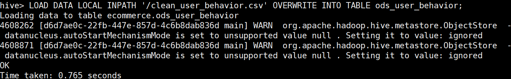

所有数据导入成功！
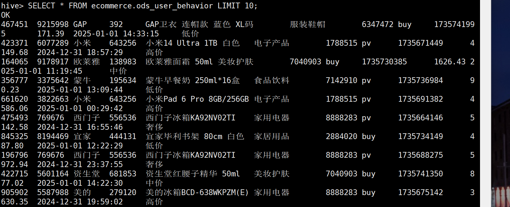
维度表创建并数据插入成功！
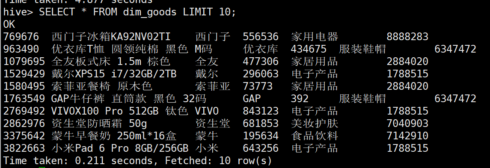
ods表数据导入成功!

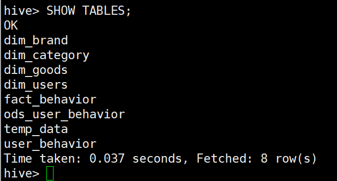

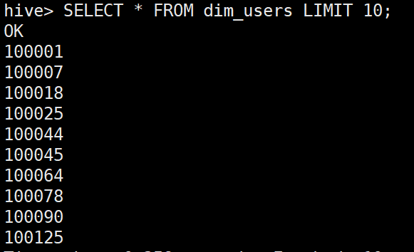

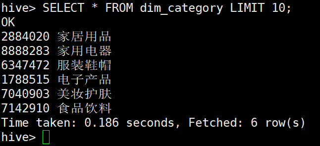

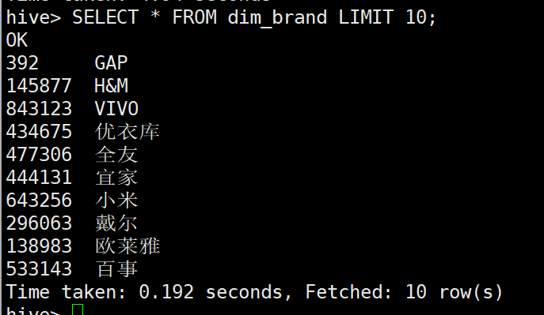

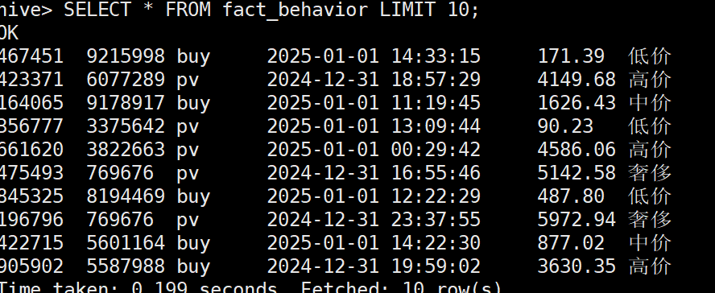
Dws层表数据插入成功！

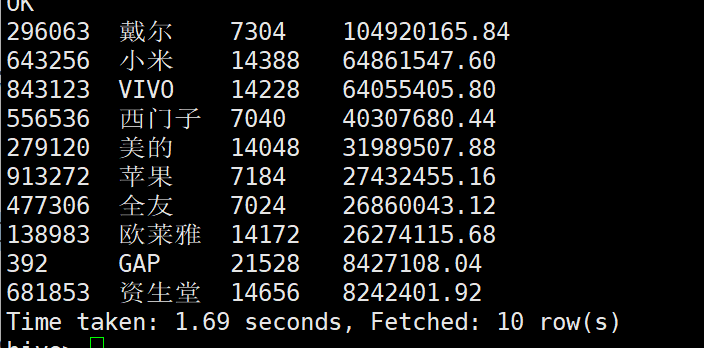

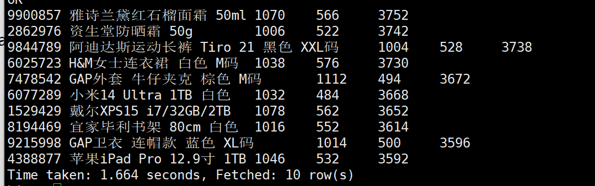

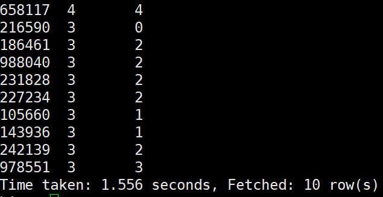

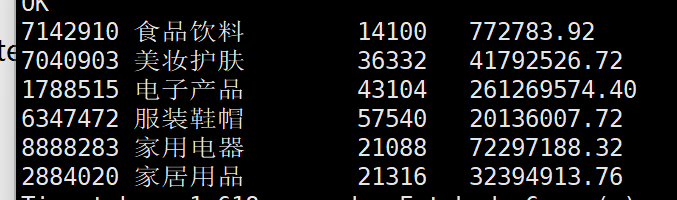

使用 Hive 完成 ODS、DWD、DWS 分层建模，对汇总结果同步至 MySQL，由 Spring Boot 提供 RESTful 接口，Vue3 + ECharts 实现数据可视化。

（2）使用 SparkSQL 替代 ETL 中的 Pandas，提升大数据量处理性能
提交命令：
spark-submit \
--master local[*] \
 --driver-memory 4G \
etl_sparksql.py

 Aaa.替代ETL 工具：用 Spark SQL 替代 Python (Pandas) 完成清洗和加载
Hive默认使用 MapReduce，速度较慢
Bbb.统一的分析入口（替代 Hive CLI）：通过 spark.sql() 在编程接口中提交 SQL，操作 Hive 表。
还在规划中。。。。
